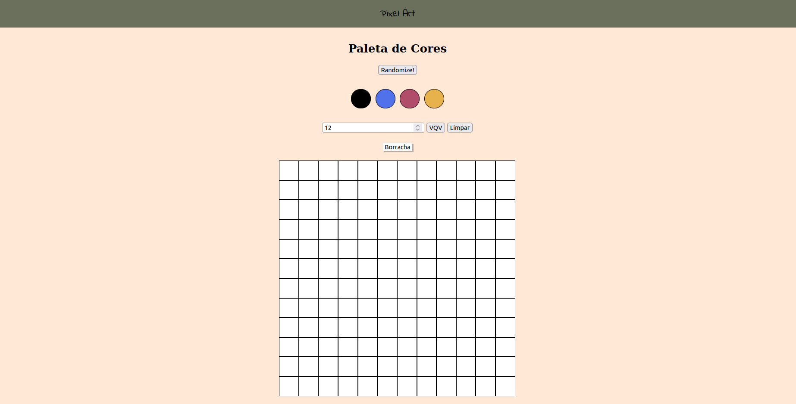

# Projeto #004 - Pixel Art!

Quarto projeto do módulo de Fundamentos do Desenvolvimento Web do curso de Desenvolvimento Web da Trybe. Ao final deste projeto, fui capaz de:

- Manipular elementos do DOM com JavaScript;
- Manipular elementos com CSS.

